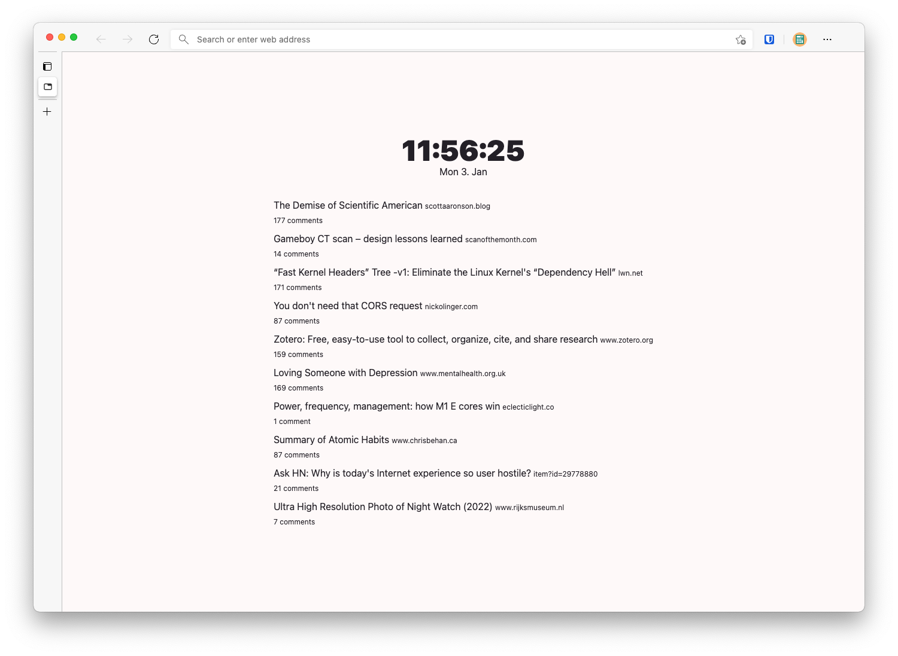

# start [](https://microsoftedge.microsoft.com/addons/detail/start/ggaeigpbmhbldacgnlafbiobppjblpic) [](https://addons.mozilla.org/en-US/firefox/addon/hnstart/)

start is my personal simple "new tab" start page.



## Features

- Dark/Light mode
- Date and Time
- Hackernews
- Shortcuts

## Dependencies

You need to have npm/yarn installed.

Install dependencies:

```sh
yarn install
# or
npm install
```

## Install

1. Build with:

```sh
yarn build
# or
npm run build
```

2. Go to your extension settings in your browser e.g. `edge://extensions/`
3. Enable Developer mode
4. Load the `public` directory as unpacked extension
